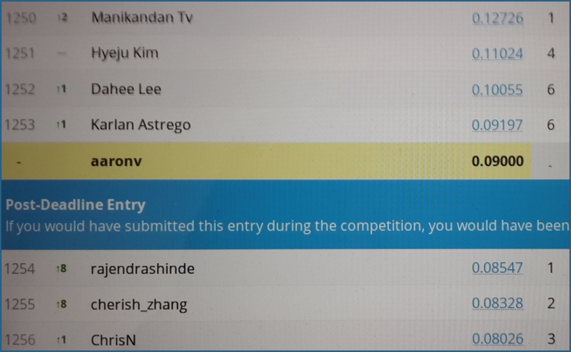
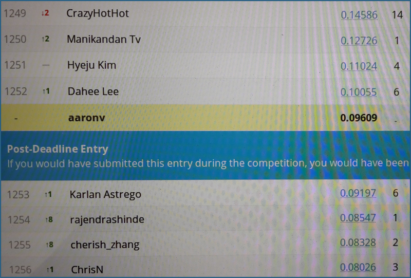
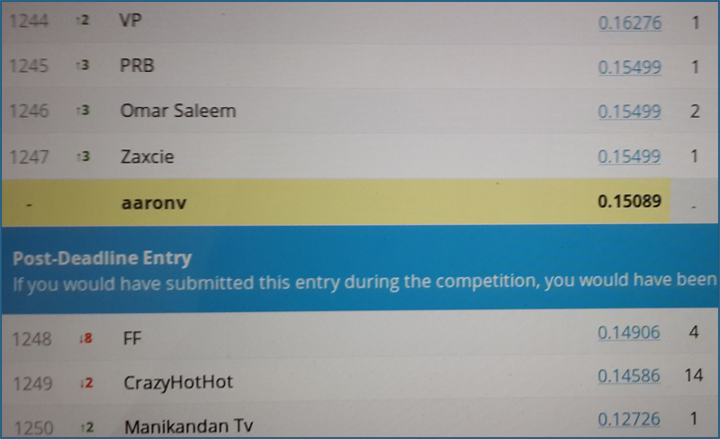

EX4: Text Mining
================

Preprocessing
-------------

Preprocessing was done using the following methods:

**Step1:**
Using Jaro Winker distance, the result was about ~0.09.

**Step2:**
Adding Jaccard distance, the result and ranking didn't change much.

**Step3:**
Adding OSA (Optimal String Alignment) distance, the result was better- about ~0.12.

**Step4:**
Final step was adding word count in query, the result got much better, around ~0.15.

**Final Score: 0.15089**
**Final Rank: 1248**


R Code
------

*loading data
```{r}
library(readr)
train <- read_csv("train.csv")
test  <- read_csv("test.csv")
```

*preprocessing
```{r}
### Preprocess the train data
library(stringdist)
# Jaccard distance
train$jaccard_title <- stringdist(train$query ,train$product_title, method="jaccard") 
train$jaccard_description <- stringdist(train$query, train$product_description, method="jaccard")
# Jaro Winker distance
train$jw_title <- stringdist(train$query, train$product_title, method="jw") 
train$jw_description <- stringdist(train$query, train$product_description, method="jw") 
# Damerau–Levenshtein (Optimal string alignment distance)
train$osa_title <- stringdist(train$query, train$product_title, method="osa") 
train$osa_description <- stringdist(train$query, train$product_description, method="osa") 

### Preprocess the test data as well
# Jaccard distance
test$jaccard_title <- stringdist(test$query ,test$product_title, method="jaccard") 
test$jaccard_description <- stringdist(test$query, test$product_description, method="jaccard")
# Jaro Winker distance
test$jw_title <- stringdist(test$query, test$product_title, method="jw") 
test$jw_description <- stringdist(test$query, test$product_description, method="jw")
# Damerau–Levenshtein (Optimal string alignment distance)
test$osa_title <- stringdist(test$query, test$product_title, method="osa") 
test$osa_description <- stringdist(test$query, test$product_description, method="osa") 
```

*word count
```{r}
library(stringi)
train$count <- sapply(train$query,
                      function(x) {
                        stri_stats_latex(str=x)['Words']
                      })
test$count <- sapply(test$query,
                     function(x) {
                       stri_stats_latex(str=x)['Words']
                       })
```


*model creation & evaluation

```{r}
train$median_relevance <- factor(train$median_relevance)

### Model creation
library(randomForest)
# Note: jaccard_description is not good- causing an error in randomforest
model <- randomForest(median_relevance ~ jw_title + jw_description + jaccard_title, data=train, ntree=100)

### Classification for evaluation
results <- predict(model1, newdata = test)

### Evaluation of results
library(Metrics)
Newsubmission = data.frame(id=test$id, prediction=results)
write.csv(Newsubmission, "model.csv", row.names=F) 
```

Ranks
-----






Model
-----

(Final model)
[Full .csv file here](model5.csv)
